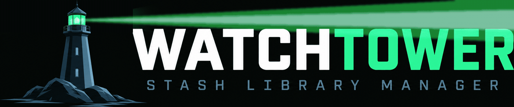

<div align="center">



# 🗼 Watchtower for Stash
### The Zero-Data-Loss Media Inventory Guardian, Live Filesystem Watcher & Atomic Renaming Engine for Stash

[](https://github.com/kmarsh2311/watchtower/releases)
[](https://github.com/stashapp/stash)
[](https://python.org)
[](LICENSE)
[](#-zero-data-loss-philosophy)

</div>

---

## ⚡ Overview

**Watchtower** is an enterprise-grade library management plugin and live background daemon built specifically for [Stash](https://github.com/stashapp/stash). 

Designed around a strict **zero-data-loss philosophy**, Watchtower continuously safeguards your library drives: tracking external file moves made in Finder or Explorer, automatically renaming videos and companion sidecars in atomic lockstep, rendering beautiful video contact sheets on disk without cluttering your Stash image database, and ingesting completed downloads the instant they finish.

Featuring a retro-futuristic Cyberpunk/Lighthouse control console with CRT warm-up animations, real-time sandboxed filename simulation, and a 6-step guided Onboarding Wizard, Watchtower transforms media organization into a fast, safe, and visual experience.

---

## 🔥 Key Features

### 🛡️ 1. Atomic Renaming Engine & Sidecar Safety
* **Full Multi-Pass Preflight:** Before any file is touched on disk, Watchtower calculates proposed paths, detects duplicate target collisions, verifies 255 UTF-8 byte limits, and validates parent directories.
* **Synchronized Sidecar Renaming:** Subtitles (`.srt`, `.vtt`) and image artwork (`video.jpg`, `video.mp4.jpg`, `_contact_sheet.jpg`) rename in lockstep with the main video file.
* **Automatic Rollback:** If Stash or the filesystem encounters any error mid-rename, all companion sidecars are restored to their original names in reverse dependency order.
* **Cross-Platform Lock:** Uses kernel-level file locks (`fcntl.LOCK_EX` on Unix/macOS, `msvcrt.LK_LOCK` on Windows) to eliminate race conditions between simultaneous Stash hooks.
* **Clean Metadata Stripping:** Automatically removes leftover conjunctions (`and`, `&`, `feat.`, `with`, `vs.`) and collapses multi-dashes without ever leaving an empty filename stem.

### 📡 2. Real-Time Background Filesystem Watcher
* **Live Storage Monitoring:** A lightweight background watchdog service continuously tracks all your configured Stash library roots.
* **Automatic Move Reconnection:** When files or folders are organized outside of Stash in Finder or Windows Explorer, Watchtower verifies file size and `OSHash` and asks Stash to adopt the new path without destructive rescans.
* **OS-Native Startup Daemon:** Optionally launches on system boot and retries until Stash comes online:
  * **macOS:** Native LaunchAgent plist with protected runtime tokens.
  * **Windows:** Hidden background VBS runtime (`WshShell.Run`).
  * **Linux:** GNOME `.desktop` autostart entry.
* **Heartbeat & Dead PID Detection:** Self-healing watchdog with 2-second heartbeat loop and token-authenticated cooperative stop.

### 📥 3. Smart Multi-Folder Download Ingest
* **Drop-Folder Automation:** Watch up to 5 incoming download directories inside your Stash library.
* **Partial Download Filter:** Automatically ignores active download temporary files (`.part`, `.partial`, `.crdownload`, `.download`, `.tmp`).
* **Dynamic Settle Timer:** Configurable delay (1 to 30 mins) that automatically resets if file size or `mtime` changes. Once the download is completely finished, Watchtower triggers an exact-path Stash scan with thumbnail, sprite, and perceptual-hash generation.

### 🖼️ 4. Visual Storyboard Contact Sheets (CSM)
* **Zero Stash Image Clutter:** High-resolution video storyboard contact sheets are saved directly beside the video file on your drive as companion files—never polluting Stash's image library.
* **Smart Vertical Video Auto-Adjust:** Automatically reflows 9:16 vertical smartphone/social media videos into balanced widescreen sheets.
* **Customizable Layouts & Banners:** Choose 4x4 (16 frames), 5x4 (20 frames widescreen), or custom grid layouts with detailed top metadata header banners showing resolution, file size, duration, and video codec.

### 🔬 5. Central Dashboard & Diagnostic Suite
* **Interactive Sandbox Previewer:** Test naming schemes against real scenes from your library in real-time before applying changes.
* **100% Read-Only Diagnostic Scanners:** Conflict-aware resolution planning, metadata recovery previews, and candidate search for missing paths.
* **250-Entry Activity Flight Recorder:** Permanent audit trail of all renames, monitor events, and file recoveries, exportable to JSON and CSV.
* **Native Desktop Notifications:** Desktop alerts on macOS, Windows, and Linux for important warnings and background failures.

---

## 📥 Installation

### Method 1: Stash Community Repository (Recommended)
1. Open Stash and navigate to **Settings ➔ Plugins ➔ Available Plugins ➔ Add Source**.
2. Paste the Community Source URL:
   ```text
   https://kmarsh2311.github.io/my-stash-plugins/index.yml
   ```
3. Find **Watchtower** in the list and click **Install**.
4. Click **Reload Plugins**. The **📚** icon will appear in your Stash navigation bar.

### Method 2: Manual Install
1. Download the latest [`librarymanager.zip`](https://kmarsh2311.github.io/my-stash-plugins/librarymanager.zip) from the release assets.
2. Extract the contents into your Stash plugins directory:
   * **Linux/macOS:** `~/.stash/plugins/librarymanager/`
   * **Windows:** `C:\Users\<Username>\.stash\plugins\librarymanager\`
3. Go to **Settings ➔ Plugins** in Stash and click **Reload Plugins**.

---

## 🚀 Quick Start Guide

1. **Launch Onboarding:** Click the **📚** icon in the top Stash navigation bar. If it's your first time, the 6-step Guided Setup Wizard will open automatically.
2. **Build Initial Inventory:** In Step 4 of the wizard, click **⚡ Build Initial Inventory Now** to map your scenes into `watchtower.db`.
3. **Configure Watched Folders:** Set your incoming download folder (e.g. `/Volumes/Media/Incoming`) to enable automatic ingest.
4. **Tune Filename Formatting:** Choose your preferred section order (`Title - Studio - Performers`), separators, and performer caps in the **Filename Management** tab.
5. **Enable Watcher Daemon:** Enable **Start Monitoring with OS** to keep your library synchronized 24/7.

---

## ⚙️ Configuration & Options

| Setting | Default | Description |
| :--- | :---: | :--- |
| **Automatic Renaming** | `OFF` | Safely renames video and companion sidecars on metadata edits. |
| **Master Title Source** | `Stash Metadata` | Drive filenames from Stash scraped metadata or preserve original disk stems. |
| **Filename Order** | `Title, Studio, Performers` | Choose the sequence of information in generated filenames. |
| **Strip Connective Words** | `ON` | Removes dangling `and`, `&`, `feat.`, `with` left when metadata is stripped. |
| **Collapse Multiple Separators** | `ON` | Cleans duplicate dashes, spaces, and punctuation into single clean dividers. |
| **Generate Contact Sheets** | `OFF` | Automatically creates storyboard contact sheets beside new videos on disk. |
| **Auto-adjust Vertical Videos**| `ON` | Automatically optimizes contact sheet grid layout for 9:16 vertical videos. |
| **Desktop Notifications** | `ON` | Native system notifications for important warnings, moves, and failures. |
| **Start with OS** | `OFF` | Starts the background filesystem watcher on system boot / login. |

---

## 🔒 Zero Data Loss Philosophy

Watchtower is engineered from the ground up to guarantee that your media collection is never damaged:
* **Safe Defaults:** All initial scans, inventory runs, and filename previews are strictly 100% read-only.
* **Isolated SQLite Database:** Watchtower maintains its own WAL-mode SQLite database (`watchtower.db`) and never modifies Stash's internal SQLite database directly.
* **Stash Native Operations:** All file moves and primary renames are delegated through Stash's native `moveFiles` GraphQL API, ensuring Stash's internal path indices stay valid.
* **Symlink Safe:** Path containment checks resolve symlinks before testing folder boundaries, preventing accidental out-of-bounds operations.

---

## 🤝 Contributing & Support

* 🐛 **Bug Reports & Features:** Please open an issue on the [GitHub Issue Tracker](https://github.com/kmarsh2311/watchtower/issues).
* ☕ **Support:** If Watchtower saves you time managing your collection, feel free to [buy me a KitKat here 🍫](https://buymeacoffee.com/kamarsh)!

---

<div align="center">
  <sub>Built with ❤️ for the Stash Community.</sub>
</div>
