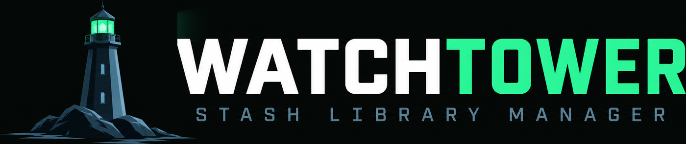

<div align="center">



# 🗼 Watchtower for Stash
### The 24/7 Real-Time Filesystem Watcher, Automated Ingest Pipeline & Media Inventory Guardian for Stash

[](https://github.com/kmarsh2311/watchtower/releases)
[](https://github.com/stashapp/stash)
[](https://python.org)
[](LICENSE)
[](#-zero-data-loss-philosophy)

</div>

---

## ⚡ Overview

**Watchtower** is a 24/7 background system guardian and automated media ingest pipeline designed from the ground up for [Stash](https://github.com/stashapp/stash).

Instead of waiting for slow, manual library sweeps or wondering if external file moves broke your scene links, Watchtower continuously listens to your storage drives in real-time. Drop downloads into incoming folders and watch them automatically verify, settle, generate visual contact sheets, and import into Stash the moment they finish. Reorganize files in Finder or Explorer without fear—Watchtower detects moves by size and `OSHash` and reconnects scenes instantly without destructive rescans.

Built with a retro-futuristic Cyberpunk/Lighthouse control console, live event stream terminal, and strict **zero-data-loss** atomic safeguards, Watchtower gives you total visibility and automated control over your media collection.

---

## 🔥 Key Features

```
 ┌─────────────────────────────────────────────────────────────────────────────┐
 │                           WATCHTOWER ARCHITECTURE                           │
 └─────────────────────────────────────────────────────────────────────────────┘
      │
      ├── 📡 24/7 Live Filesystem Watcher (Continuous background drive monitoring)
      │
      ├── 📥 Smart Ingest Pipeline (Drop-folder settle timers & auto-import)
      │
      ├── ⚡ External Move Reconnection (Tracks Finder/Explorer moves by OSHash)
      │
      ├── 🖼️ Visual Contact Sheets (High-res storyboards on disk with zero Stash clutter)
      │
      ├── 🛡️ Atomic Renaming Engine (Sync'd sidecar rollback & collision protection)
      │
      └── 🖥️ Cyberpunk Control Terminal (Live stream feed, diagnostics & flight recorder)
```

---

### 📡 1. 24/7 Live Storage Monitoring & Background Watcher
* **Continuous Real-Time Tracking:** Watchtower runs a silent, lightweight watchdog service that monitors all your configured Stash library roots simultaneously.
* **No More Manual Rescan Sweeps:** New files, modifications, deletions, and folder relocations are detected in real-time the moment they happen on your drives.
* **OS-Native Startup Daemon:** Keeps monitoring 24/7 without needing a web browser open:
  * **macOS:** Native LaunchAgent plist with protected tokens.
  * **Windows:** Silent background VBS runtime (`WshShell.Run`).
  * **Linux:** GNOME `.desktop` autostart daemon.
* **Self-Healing Heartbeat:** 2-second heartbeat loop, dead PID detection via `os.kill(pid, 0)`, and graceful token-authenticated control.

---

### 📥 2. Automated Multi-Folder Download Ingest & Settle Pipeline
* **Zero-Touch Ingest:** Configure up to 5 incoming download folders. Drop new videos in and let Watchtower handle everything from verification to import.
* **Partial Download Protection:** Actively filters out in-progress downloads (`.part`, `.partial`, `.crdownload`, `.download`, `.tmp`).
* **Dynamic Stability Settle Timers:** Watches file size and `mtime` continuously. The import timer (configurable from 1 to 30 mins) automatically resets if a transfer is still writing.
* **Targeted Automated Scans:** Once a video is 100% stable, Watchtower triggers an exact-path Stash scan with thumbnail, sprite, and perceptual-hash generation—importing only the new file in seconds.
* **Subfolder Discovery:** Automatically discovers and processes videos nested inside newly downloaded subfolders.

---

### ⚡ 3. Smart External Move Tracking & Auto-Reconnection
* **Organize Anywhere with Zero Broken Links:** Move or rename files and folders in Finder, Windows Explorer, or terminal scripts without breaking your Stash library.
* **Cryptographic & Size Verification:** When an inventoried file moves, Watchtower verifies its size and `OSHash` at the new destination to guarantee identity.
* **Targeted Path Updates:** Automatically asks Stash to scan the destination path and update the scene record—preserving all scene IDs, play counts, ratings, and tag histories.

---

### 🖼️ 4. Visual Storyboard Contact Sheets (CSM)
* **Zero Stash Image Database Clutter:** High-resolution video storyboard sheets are saved directly beside the video file on your drive as companion files (`video_contact_sheet.jpg`)—visible in Finder/Explorer without bloating Stash's internal image library.
* **Smart 9:16 Vertical Video Reflow:** Automatically detects smartphone and social media vertical videos and optimizes the grid layout for standard widescreen viewing.
* **Custom Grid Layouts & Headers:** Choose 4x4 (16 frames), 5x4 (20 frames widescreen), or custom grids with detailed metadata header banners displaying resolution, file size, duration, and video codec.

---

### 🛡️ 5. Atomic Renaming Engine & Sidecar Safety
* **Full Multi-Pass Preflight:** Before any file is modified on disk, Watchtower calculates proposed filenames, checks 255-byte filesystem boundaries, and verifies destination directories.
* **Synchronized Sidecar Renaming:** Subtitles (`.srt`, `.vtt`) and image artwork (`video.jpg`, `video.mp4.jpg`, `_contact_sheet.jpg`) rename in lockstep with the video.
* **Atomic Rollback Guarantee:** If Stash or the filesystem encounters an error mid-rename, all companion sidecars are restored to their original names in reverse dependency order.
* **Kernel-Level Lock Protection:** Cross-platform file locking (`fcntl` / `msvcrt`) eliminates race conditions between simultaneous Stash hooks.
* **Clean Conjunction Stripping:** Automatically cleans dangling connective words (`and`, `&`, `feat.`, `with`, `vs.`) and collapses multi-dashes without ever producing empty stems.

---

### 🖥️ 6. Cyberpunk Control Terminal & Diagnostic Suite
* **Interactive Live Stream Terminal:** Real-time visual dashboard with CRT scanlines, glowing status pills, and live event monitoring.
* **250-Event Activity Flight Recorder:** Permanent audit trail of every rename, monitor event, download ingest, and recovery, exportable to JSON and CSV.
* **100% Read-Only Diagnostic Tools:** Built-in dry-run scanners for conflict resolution, metadata merge previews, and missing file candidate searches.
* **Interactive Simulation Sandbox:** Test custom naming formats against real scenes in your library with instant live previews before enabling automatic renames.
* **Native Desktop Notifications:** Desktop alerts on macOS, Windows, and Linux for important warnings, unavailable roots, and background failures.

---

## 📥 Installation

### Method 1: Stash Community Repository (Recommended)
1. In Stash, go to **Settings ➔ Plugins ➔ Available Plugins ➔ Add Source**.
2. Paste the Community Source URL:
   ```text
   https://kmarsh2311.github.io/my-stash-plugins/index.yml
   ```
3. Find **Watchtower** in the list and click **Install**.
4. Click **Reload Plugins**. The **📚** icon will appear in your Stash top navigation bar.

### Method 2: Manual Install
1. Download [`librarymanager.zip`](https://kmarsh2311.github.io/my-stash-plugins/librarymanager.zip).
2. Extract the contents into your Stash plugins folder:
   * **Linux/macOS:** `~/.stash/plugins/librarymanager/`
   * **Windows:** `C:\Users\<Username>\.stash\plugins\librarymanager\`
3. Go to **Settings ➔ Plugins** and click **Reload Plugins**.

---

## 🚀 Quick Start Guide

1. **Guided Onboarding:** Click the **📚** icon in the Stash navigation bar to launch the 6-step setup wizard.
2. **Build Baseline Index:** In Step 4, click **⚡ Build Initial Inventory Now** to map your scenes into `watchtower.db`.
3. **Configure Watched Folders:** Add your incoming download folder (e.g. `/Volumes/Media/Incoming`) to enable automated ingest.
4. **Enable 24/7 Monitoring:** Turn on **Start Monitoring with OS** to keep your library guarded 24/7.
5. **Tune Filename Rules:** Choose your preferred naming format and separators in the **Filename Management** tab.

---

## ⚙️ Configuration & Options

| Setting | Default | Description |
| :--- | :---: | :--- |
| **Start with OS** | `OFF` | Starts the background filesystem watcher on system boot / login. |
| **Automatic Incoming Scan** | `OFF` | Automatically imports finished downloads from incoming folders. |
| **Incoming Settle Minutes** | `5 min` | Time a video must remain unchanged before Stash imports it. |
| **Reconcile External Moves** | `OFF` | Reconnects scenes moved outside of Stash using size and OSHash verification. |
| **Generate Contact Sheets** | `OFF` | Creates video storyboard sheets on disk beside incoming videos. |
| **Auto-adjust Vertical Videos**| `ON` | Optimizes contact sheet layout for 9:16 vertical smartphone videos. |
| **Automatic Renaming** | `OFF` | Safely standardizes video and sidecar filenames on metadata edits. |
| **Desktop Notifications** | `ON` | Native system alerts for important warnings, moves, and failures. |

---

## 🔒 Zero Data Loss Philosophy

Watchtower is engineered to guarantee that your media collection is never damaged:
* **Safe Defaults:** All initial scans, inventory runs, and filename previews are strictly 100% read-only.
* **Isolated SQLite Database:** Watchtower maintains its own WAL-mode database (`watchtower.db`) and never modifies Stash's internal SQLite database directly.
* **Stash Native Operations:** All primary file moves and renames are executed through Stash's native `moveFiles` GraphQL API, keeping Stash's internal path indices valid.
* **Symlink Safe:** Path containment checks resolve symlinks before testing folder boundaries, preventing accidental out-of-bounds operations.

---

## 🤝 Contributing & Support

* 🐛 **Bug Reports & Feature Requests:** Please open an issue on the [GitHub Issue Tracker](https://github.com/kmarsh2311/watchtower/issues).
* ☕ **Support:** If Watchtower saves you time managing your collection, feel free to [buy me a KitKat here 🍫](https://buymeacoffee.com/kamarsh)!

---

<div align="center">
  <sub>Built with ❤️ for the Stash Community.</sub>
</div>
