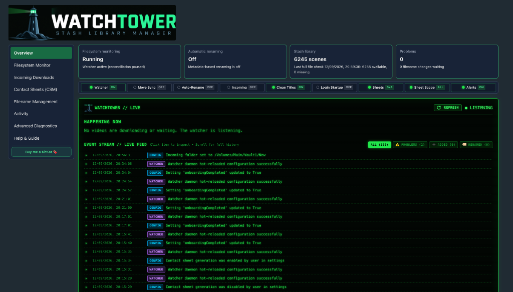
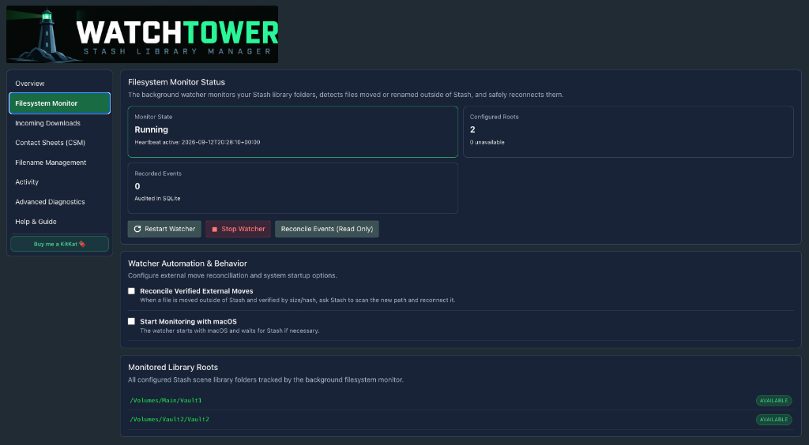
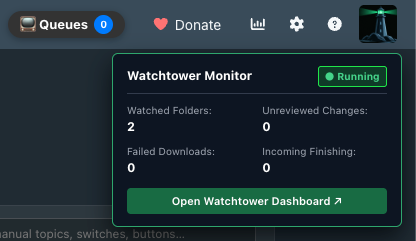
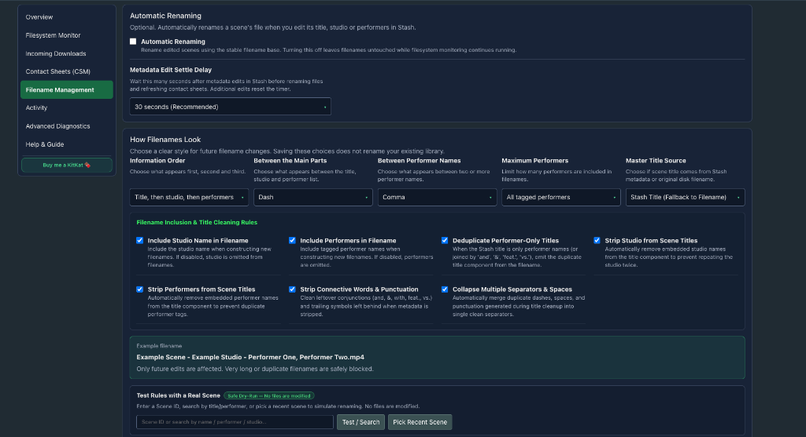
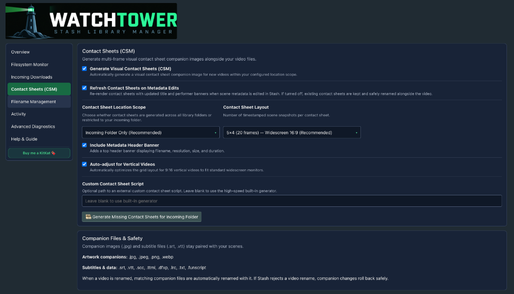

<div align="center">


# 🗼 Watchtower for Stash
### Filesystem monitoring, media ingest and library management for Stash

[](https://github.com/kmarsh2311/watchtower/releases/tag/v1.0.17)
[](https://github.com/stashapp/stash)
[](https://python.org)
[](LICENSE)

<br />



</div>

---

## Overview

Watchtower is a filesystem watcher and library-management plugin for [Stash](https://github.com/stashapp/stash). It monitors configured storage roots, helps import completed downloads, keeps an inventory of scene files, and helps you investigate files moved or renamed outside Stash.

Watchtower is designed to make potentially disruptive operations visible and reviewable. Straightforward, unambiguous single-file moves can be reconciled automatically when enabled; grouped folder changes require your review and approval. If a match cannot be verified, Watchtower should leave it for your attention rather than guess.

**New in v1.0.13:** grouped review for external folder moves and renames, Backlog Organiser reliability improvements, optional resolution tokens in filenames, and independent controls for Automatic Filing and Automatic Renaming. See the [release notes](https://github.com/kmarsh2311/watchtower/releases/tag/v1.0.13) for the full change summary.

> **Before using file-changing features:** Back up your Stash database and important media, check your storage-root configuration, and try filing, renaming or reconciliation on a small set of files first. Automatic Filing is individually labelled **Beta**; Watchtower as a whole is not a beta release.

---

## Key features

### 1. Background filesystem monitoring

- Watch configured Stash library roots for new files, moves, renames and deletions.
- Review watcher health, pending changes and folder status from the Stash navigation bar.
- Optionally launch the monitor at login/startup on macOS, Windows or supported Linux desktop environments.
- Use the activity view to understand what Watchtower detected and which items require attention.



### 2. Incoming-folder ingest

Configure up to five incoming folders. Watchtower waits for files to settle before initiating targeted Stash scans and can discover media inside incoming subfolders. It excludes common temporary downloads, including `.part`, `.partial`, `.crdownload`, `.download` and `.tmp`, rather than treating them as finished videos.

Optional contact-sheet generation creates visual previews alongside media files. Available output and processing options depend on the installed tools and your configuration.



### 3. External moves, folder renames and reconciliation

Watchtower observes changes made outside Stash—for example, through Finder, File Explorer or a command-line tool. Different changes follow different workflows:

| What changed | Watchtower's approach |
| :--- | :--- |
| **One file moved within monitored storage** | If the match is unambiguous and verification succeeds, automatic reconciliation can reconnect the existing Stash record when external-move reconciliation is enabled. Ambiguous matches require attention. |
| **Populated folder renamed or moved** | Related events are collected into a grouped review, with source/destination paths and member details. You approve reconciliation before Watchtower requests a targeted Stash scan and checks the resulting associations. |
| **Move between volumes** | Copy-and-delete event sequences can be correlated after the transfer settles. Folder-level changes require review; incomplete or ambiguous transfers should remain unresolved. |
| **Folder copied while the original remains** | Watchtower distinguishes a copy from a move and presents it for review rather than automatically assigning the original scene to the copy. |
| **Restart during reconciliation** | Pending batch information is stored in SQLite so work can be examined and recovery attempted after restart. Check the resulting status before assuming an interrupted operation completed. |

**How folder reconciliation works:** Watchtower first detects and groups likely related events. You then review the proposed source and destination and approve the action. It requests a scan limited to the relevant destination and verifies the members afterward. A detected move is **not** the same thing as a successfully verified repair; unresolved members are reported for further review.

**Important boundaries:** Both relevant storage locations must be monitored and accessible. Disconnected network shares can delay detection or recovery; externally modified or re-encoded files may fail identity checks; and files dispersed among unrelated destinations may need individual review. NAS behaviour varies across operating systems and mounts.

The grouped workflows have automated coverage using synthetic filesystem trees and mocked Stash GraphQL, including a 117-file folder-move scenario. They have **not** been exhaustively validated against every live NAS and filesystem configuration. Start with a small, backed-up test folder before trying large moves in your own library.

### 4. Automatic Filing and Backlog Organiser <small>— Beta feature</small>

Automatic Filing inspects newly imported media in your watched incoming folders and proposes destination paths inside your library based on matched performers, studios, tags, or custom folder mappings.

- **Location vs Filename:** **Filing changes a file's folder location, not its filename.** Automatic Renaming is an independent feature that follows its own settings.
- **Candidate Selection:** When a scene matches exactly one destination folder, it proposes that destination. When multiple destinations are plausible (e.g. multiple performers with dedicated folders), Watchtower prompts you to pick your preferred destination before confirming.
- **Background Task Execution:** Approved transfers run as serialized background jobs in Stash's task runner, allowing you to queue moves and navigate away safely while transfers complete. Interrupted transfers or unexpected restarts automatically trigger recovery upon startup.
- **Handling Unresolved Filing Alerts:** If a file lacks matching metadata or folders, it appears in Command Center under **Needs Attention**. Use **`🎬 OPEN SCENE`** (or **`⚡ EDIT WITH FASTTAG`**) to assign metadata and click **`⟳ RETRY FILING`**, or click **`✕ DISMISS ALERT`** to safely clear the alert and keep the file in Incoming without deleting media.
- **Backlog Organiser (`📁 ORGANISE EXISTING FILES`):** Pre-existing files in Incoming are protected by an initial baseline snapshot so they are never moved unexpectedly. The header counter dynamically tracks all unorganized and dismissed incoming files, allowing you to batch-evaluate and file backlog media whenever you are ready.

> **⚠️ Prudence and Verification:** Because filing physically moves files on disk, always inspect proposed destinations carefully before approving. Never assume everything will work without checking: test your first few filing proposals on small sample files, verify the resulting paths in Stash and Finder/Explorer, and ensure your Stash database and media backups are up to date before relying on automated workflows.

### 5. Filename formatting and sidecars

Configure filename components, their order and separators, and preview the proposed result against a real scene before applying a change. Automatic Renaming is optional and controls metadata-triggered renames independently of Automatic Filing.

The optional **Include Video Quality** setting uses the selected video file's resolution stored in Stash, producing tokens such as `[720p]`, `[1080p]` or `[2160p]`. It is **off by default** and can place the token at the beginning or end. Missing resolution information leaves the token out. A preview is a simulation: it does not rename the file.

Watchtower also checks filename-length and collision conditions and handles supported companion files such as subtitle and artwork sidecars as part of applicable rename operations. If an operation fails, it attempts to roll back its changes and reports anything that still needs attention. Keep a backup; no software can guarantee recovery from every filesystem, power or network failure.



### 6. Contact sheets and diagnostics

- Generate optional storyboard contact sheets beside media files, with layouts for widescreen and vertical videos.
- Inspect activity, storage availability and warnings in the dashboard.
- Use read-only filename previews and other diagnostics to understand proposed changes before approving an operation.



---

## Installation

### Option 1: Stash plugin source

1. In Stash, open **Settings → Plugins → Available Plugins → Add Source**.
2. Add the source URL:

   ```text
   https://kmarsh2311.github.io/my-stash-plugins/index.yml
   ```

3. Find **Watchtower**, install it and reload plugins.

### Option 2: Manual installation

1. Download [`librarymanager.zip` from the v1.0.17 release](https://github.com/kmarsh2311/watchtower/releases/download/v1.0.17/librarymanager.zip).
2. Extract it into the Watchtower plugin directory, for example `~/.stash/plugins/librarymanager/` on macOS/Linux or `C:\Users\<Username>\.stash\plugins\librarymanager\` on Windows.
3. Reload plugins in Stash.

The filesystem-monitoring dependency is bundled with the plugin. Contact-sheet generation uses available supporting tools such as ImageMagick or FFmpeg; see the in-app setup and diagnostics for your environment.

**Upgrading:** Back up the plugin's configuration/database and your Stash database before upgrading, especially if you use Automatic Filing or external-move reconciliation. The v1.0.13 migration removes legacy filing-created filename locks without scheduling a bulk rename; future metadata edits still follow your Automatic Renaming setting.

---

## Quick start

1. Open Watchtower from Stash's navigation bar and complete the guided setup.
2. Check the storage roots imported from your Stash configuration, then choose the incoming folders you want to monitor.
3. Build the initial inventory and check monitor status.
4. Start with monitoring and read-only previews. Enable incoming scans, reconciliation, filing or renaming only when you're comfortable with their settings.
5. Test file-changing workflows on a small, backed-up sample before using them across your library.


---

## Common settings

| Setting | Default shown in the current README | What it does |
| :--- | :---: | :--- |
| Start with OS | Off | Starts the background watcher when you log in or start the system. |
| Automatic Incoming Scan | Off | Scans completed files from configured incoming folders into Stash. |
| Incoming Settle Minutes | 5 minutes | Waits for files to remain unchanged before ingest. |
| Reconcile External Moves | Off | Enables reconciliation of verified external file movements. |
| Generate Contact Sheets | Off | Generates optional media contact sheets. |
| Automatic Renaming | Off | Renames files when relevant scene metadata changes, according to your chosen rules. |
| Include Video Quality | Off | Adds a resolution token to generated filenames when resolution is available. |

Consult the in-app settings for the full set of controls and defaults for your installed version.

---

## Safety and known limitations

Watchtower uses read-only inventory and preview operations, checks file identity before reconciling eligible moves, and provides review steps for grouped changes. It maintains its own SQLite state and uses Stash operations where appropriate rather than directly editing Stash's database.

These safeguards reduce risk; they are **not a zero-data-loss guarantee**. Back up your Stash database and irreplaceable media, particularly before reorganising a large folder tree. If a NAS disconnects, a file changes during transfer, or a proposed match is ambiguous, inspect the warning and resolve the underlying problem before approving further changes.

Grouped folder recovery is a substantial new feature in v1.0.13. Its automated tests cover complex cases, but real-world results can depend on the operating system, file watcher and network share. Please report issues with enough detail to reproduce them.

---

## Feedback, issues and support

I'm releasing this update to get practical feedback before deciding what to build next. I'd especially like to hear how grouped folder reconciliation and Automatic Filing behave with different storage layouts, and which parts of the UI are confusing or helpful.

Open a [GitHub issue](https://github.com/kmarsh2311/watchtower/issues) with your operating system, Stash version, storage type (local disk, SMB/NFS, etc.), the steps you took, and relevant logs with private paths or tokens removed. Feature suggestions are welcome too.

If Watchtower saves you time, you can also [buy me a KitKat 🍫](https://buymeacoffee.com/kamarsh).

---

<div align="center"><sub>Built for the Stash community.</sub></div>
